# 🚀 RBAC Project Management System

A full-stack project management platform built with **Django** (Backend) and **Next.js** (Frontend), featuring **Role-Based Access Control (RBAC)**, **real-time notifications** via **Redis, WebSockets**, and **Django Channels**, and **background task processing** with **Celery**.

---

## 🧩 Tech Stack

- **Backend**: Django, Django REST Framework
- **Frontend**: Next.js (React + TailwindCSS)
- **Real-time**: WebSocket, Django Channels, Redis Pub/Sub
- **Async Tasks**: Celery + Redis
- **Database**: PostgreSQL
- **Notifications**: WebSocket + Redis + Django Signals
- **Deployment**: Docker, Gunicorn, Nginx

---

## 🔐 Roles & Responsibilities

| Role              | Permissions & Capabilities |
|-------------------|----------------------------|
| **Superadmin**     | - Create/manage organizations <br> - Assign Admins <br> - System-wide control & logs |
| **Admin**          | - Manage users within their organization <br> - Create Salesperson, Project Manager, Developer, Support roles |
| **Salesperson**    | - Add clients <br> - Create projects <br> - Input project cost and discount |
| **Verifier**       | - Validate project payments <br> - Confirm or reject payment verification |
| **Project Manager**| - Oversee project development <br> - Assign tasks to developers <br> - Track progress |
| **Developer**      | - Work on assigned project tasks <br> - Submit progress & status |
| **Support**        | - Handle client issues post-deployment <br> - Log support tickets and bug reports |

---

## 🧠 Key Features

### ✅ Role-Based Access Control (RBAC)
- Roles stored using `models.TextChoices` and attached to users
- Permissions defined and enforced per role
- Superadmin has system-wide control; other roles are scoped to organizations

### ⚙️ Project Lifecycle

1. Superadmin creates an **Organization** and assigns an **Admin**.
2. Admin hires a **Salesperson**, who brings **Clients** and **Projects**.
3. Projects contain:
   - Cost
   - Discount
   - Timeline
   - Assigned PM & Developers
4. **Verifier** confirms payment before project starts.
5. **Project Manager** assigns tasks to **Developers**.
6. Developers update task progress.
7. After deployment, **Support** handles issues.

### 🔔 Real-Time Notifications

- Admins and relevant users receive **WebSocket notifications**:
  - When a new project is added
  - When payment is verified
  - When tasks are updated
- Notifications are handled using:
  - **Django Channels**
  - **Redis Pub/Sub**
  - **Custom WebSocket Consumers**

### ⏳ Background Tasks (Celery)

- Email notifications for password reset, new user creation, etc.
- Payment confirmation via external services
- Daily summary reports to Superadmin

### 🧪 Signals

- **Django Signals** trigger notifications and logs when:
  - A new user is created
  - A project status changes
  - Payment is verified

---

## 🗂️ Project Structure (Backend)

🚀 Setup Instructions
Backend
bash
Copy
Edit
cd backend
python -m venv venv
source venv/bin/activate
pip install -r requirements.txt

# Start Redis
redis-server

# Run Celery
celery -A project worker --loglevel=info

# Run Django
python manage.py runserver


## 📈 ER Diagram (Mermaid)

```mermaid
classDiagram
    class User {
        +UUID id
        +string username
        +string email
        +string password
        +RoleChoices role
        +bool is_active
        +datetime created_at
    }

    class Organization {
        +UUID id
        +string name
        +User created_by (Superadmin)
        +datetime created_at
    }

    class Admin {
        +UUID id
        +FK user_id
        +FK organization_id
    }

    class Salesperson {
        +UUID id
        +FK user_id
        +FK organization_id
    }

    class Verifier {
        +UUID id
        +FK user_id
        +FK organization_id
    }

    class ProjectManager {
        +UUID id
        +FK user_id
        +FK organization_id
    }

    class Developer {
        +UUID id
        +FK user_id
        +FK organization_id
    }

    class Support {
        +UUID id
        +FK user_id
        +FK organization_id
    }

    class Client {
        +UUID id
        +string name
        +string contact
        +FK salesperson_id
    }

    class Project {
        +UUID id
        +string title
        +text description
        +float cost
        +float discount
        +FK client_id
        +FK created_by (Salesperson)
        +FK verifier_id
        +FK manager_id
        +bool is_verified
        +datetime created_at
    }

    class Payment {
        +UUID id
        +float amount
        +bool verified
        +FK project_id
        +datetime created_at
    }

    class Task {
        +UUID id
        +string title
        +string status
        +FK developer_id
        +FK project_id
    }

    class SupportTicket {
        +UUID id
        +string issue
        +FK support_id
        +FK project_id
        +datetime created_at
    }
```


## Relationships
```

    User <|-- Admin
    User <|-- Salesperson
    User <|-- Verifier
    User <|-- ProjectManager
    User <|-- Developer
    User <|-- Support
    Organization "1" --> "many" Admin
    Organization "1" --> "many" Salesperson
    Organization "1" --> "many" Verifier
    Organization "1" --> "many" Developer
    Organization "1" --> "many" ProjectManager
    Organization "1" --> "many" Support
    Salesperson "1" --> "many" Client
    Client "1" --> "many" Project
    Project "1" --> "1" Payment
    Project "1" --> "many" Task
    Project "1" --> "many" SupportTicket
```

📜 Sequence Diagrams
Superadmin Flow
mermaid
```
sequenceDiagram
    participant Superadmin
    participant System
    participant Organization
    participant Admin

    Superadmin->>System: Create Organization
    System->>Organization: Save new org
    Superadmin->>System: Assign Admin
    System->>Admin: Generate temp password
    System->>Redis: Publish Admin Assigned event
    Redis->>WebSocket: Notify Admin

```
Admin Flow
mermaid
```
sequenceDiagram
    participant Admin
    participant System
    participant Salesperson
    participant Verifier
    participant PM
    participant Dev
    participant Support
```

```
    Admin->>System: Create Salesperson
    Admin->>System: Create Verifier
    Admin->>System: Create Project Manager
    Admin->>System: Create Developer
    Admin->>System: Create Support Staff
    System->>Redis: Publish Role Created event
    Redis->>WebSocket: Notify Users
    
```    
## Salesperson Flow

mermaid
```
sequenceDiagram
    participant Salesperson
    participant Client
    participant Project
    participant Verifier
    participant System

    Salesperson->>System: Add Client
    Salesperson->>System: Create Project with Cost & Discount
    System->>Verifier: Assign for verification
    System->>Redis: Publish ProjectCreated
    Redis->>WebSocket: Notify Verifier
```    
## Verifier Flow

mermaid
```
sequenceDiagram
    participant Verifier
    participant System
    participant Celery
    participant Redis

    Verifier->>System: Verify Project Payment
    System->>Django Signal: project_verified
    Django Signal->>Redis: Publish event
    Redis->>WebSocket: Notify Frontend
    Django Signal->>Celery: Send Email Task
```    
    
## Project Manager & Developer Flow

mermaid
```
sequenceDiagram
    participant PM
    participant Dev
    participant Project
    participant Task

    PM->>System: Create Task under Project
    PM->>System: Assign Task to Developer
    Dev->>System: Update Task Status
    System->>Redis: Publish Task Updated
    Redis->>WebSocket: Notify PM
```    
Support Flow
mermaid
```
sequenceDiagram
    participant Support
    participant System
    participant Ticket

    Support->>System: Create Ticket for Project
    System->>Project: Attach Ticket
    System->>Redis: Notify Admin/PM
    
```    
⚙️ Installation

# Backend
cd backend
python -m venv env
source env/bin/activate
pip install -r requirements.txt
python manage.py migrate
python manage.py runserver

# Frontend
cd frontend
npm install
npm run dev

# Redis (Mac)
brew install redis
redis-server

# Celery
celery -A your_project worker --loglevel=info
celery -A your_project beat --loglevel=info

# Django Channels: Redis consumer runs via runserver or Daphne/Uvicorn
🚀 Project Structure

```
portfolio-tracker/
├── backend/
│   ├── apps/
│   │   ├── users/
│   │   ├── organization/
│   │   ├── projects/
│   │   └── notifications/
│   ├── celery.py
│   ├── routing.py
│   └── ...
├── frontend/
│   ├── pages/
│   ├── components/
│   ├── utils/websocket.ts
│   └── ...

```
## 📡 Real-Time Architecture
Channels + Redis: Used for real-time messaging.

WebSocket Layer: Subscribed to role-based events.

Redis Pub/Sub: Connects Django Signals → WebSocket consumers.

📬 Notification Flow
Admin assigns a user → Signal triggers.

Signal publishes to Redis.

WebSocket picks up event and pushes notification.

Email is sent asynchronously using Celery.

📤 Async Email Notifications
Celery handles background job for email.

Triggers include:

New Admin/Salesperson/Verifier assignments.

Project approval.

Task assignment.

Ticket escalation.

## ✅ Future Enhancements
JWT Authentication with refresh.

Role-Based Dashboards (Dynamic Sidebar).

SaaS Billing System.

Audit Logging & Admin Analytics.

## 👨‍💻 Author
Ramesh Rawat
Backend | Full Stack | System Design
Experienced in building scalable Django-based SaaS products with React frontend.

## 📄 License
MIT License

yaml

---

Let me know if you'd like this turned into a downloadable file or published in your GitHub repository with live Mermaid previews (using `markdown-mermaid` or GitHub Actions).


```


